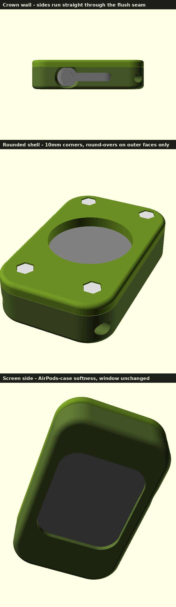

# Apple Watch "Pocket Carry" Case — 1st-gen (Series 0)

A 3D-printable case that turns an original Apple Watch into a standalone,
carryable pocket gadget — the *"put the phone down"* fob you saw in the
Instagram ad. Those cases are built for the **Apple Watch Ultra**; this design
re-creates the same idea (bolted front/back sandwich, exposed screen, side
controls, back charging window, bottom lanyard) but is **re-dimensioned for the
1st-generation Apple Watch (Series 0)** in both **38 mm** and **42 mm** sizes.

Everything is a single parametric OpenSCAD file, so you can tune every dimension
to your exact watch and your printer.



---

## How it works

Two printed parts clamp the watch like a sandwich:

| Part | Role |
|------|------|
| **Bezel** (front) | The watch drops in **face-first**. A lip around the screen window holds it from falling forward. The right wall has an opening for the **Digital Crown** (with a finger scallop) and a slot for the **side button**. A transverse **lanyard hole** runs through the bottom block. |
| **Backplate** | Bolts onto the back with 4 hex bolts and clamps the watch. A **central round window** exposes the sensor/back so the **magnetic charger still reaches it** — you can charge without removing the watch. |

**Hardware you supply:** 4× **M3×10 hex-head bolts** (DIN 933, 5.5 mm across
flats — hardware-store standard) and a length of **paracord** for the lanyard.
Prefer machine threads over self-tapping? Swap `screw_pilot_d` to 4.0 and use
M3 heat-set inserts.

### The bolt detail

Each hex head drops into a hex-shaped pocket on the backplate and sinks
**fully below the surface** (~0.4 mm sub-flush):

- **Lays dead flat** — nothing protrudes from the back, so the case sits flat
  on a table and nothing snags in a pocket. The silver hexagons read as a
  clean machined detail in the surface.
- **Security** — once seated, the hex pocket keys the head against rotation,
  so the bolts cannot vibrate loose. To remove them you back the case apart
  deliberately; they never walk out on their own.
- Tighten with a 5.5 mm nut driver / socket — the driver reaches the head
  until the final fraction of a turn drops it into the keyed seat, then give a
  last snug by hand pressing the bolt home. Don't overtighten — printed
  threads strip.

---

## Ergonomics — will it disappear into a small/medium hand?

Finished dimensions (42 mm watch): **41.9 × 66.8 × 16.7 mm**. For scale:

| Object | Size (mm) |
|--------|-----------|
| Zippo lighter | 38 × 57 × 13 |
| **This case (42 mm watch)** | **41.9 × 66.8 × 16.7** |
| **This case (38 mm watch)** | **39.3 × 63.4 × 16.7** |
| AirPods Pro case | 45 × 61 × 22 |
| Car key fob (typical) | ~40 × 75 × 18 |

So it sits between a Zippo and an AirPods case — and it's **thinner than
both** feel in the pocket. A small-to-medium adult palm is roughly 70–85 mm
across; at ~42 mm wide the case spans about half the palm, and at ~65 mm long
it tucks fully inside curled fingers. Closed-fist carry works; pocket carry
disappears.

Shape decisions made for hand feel:

- **All outer edges filleted** (2.4 mm front part, 1.6 mm back) — soap-bar
  edges; it feels like a river pebble, not a project box.
- **10 mm corner radius** on the brick outline — the AirPods-case silhouette.
- **Slimmed end blocks** vs. a naive design — only as much material above and
  below the watch as the bolts and lanyard actually need.
- **Finger scallop** around the Digital Crown opening so your fingertip can
  reach the crown through a 2.6 mm wall without the opening being oversized.
- The two parts meet **flush** — the sides run straight through the parting
  line with round-overs only on the front and back faces, so the seam reads
  as a hairline, exactly like an earbud-case shell.

The width and thickness are watch-driven (36.4 mm body + minimum walls;
10.5 mm body + front face + backplate) and can't shrink further without
thinning protection. The 4 mm backplate is what lets the bolt heads bury
completely — the case **lays dead flat on its back**, nothing protrudes on
any face.

---

## ⚠️ Read this first — you must confirm two things

I built this from the **official 1st-gen body dimensions** (38 mm:
38.6 × 33.3 × 10.5; 42 mm: 42.0 × 35.9 × 10.5 — note the 42 mm *first-gen*
body is smaller than the 42.5 × 36.4 Series 1–3 case), but I could not
measure *your* watch or *your* printer. Two things need your eyes before you
commit to a full print:

1. **Which size is your watch — 38 mm or 42 mm?**
   Measure the aluminum body height (top to bottom, ignore the band):
   - ≈ **38.6 mm** → use `WATCH_SIZE = 38`
   - ≈ **42.0 mm** → use `WATCH_SIZE = 42`
   (Or check the back engraving / Settings → General → About → Model.)

2. **The Crown & side-button positions have been tuned against a physical
   1st-gen watch** (Apple publishes no drawing; positions started from photo
   analysis and were corrected through test prints). Defaults put the crown
   centre 26 % of the body height down from the top edge, with the button
   slot running from there to 87 % down. **Print the side gauge first**
   (5-minute print, below) to confirm on your own watch before printing the
   full bezel.

Everything is parametric precisely so you can nudge these. Defaults are sane
starting points, not guarantees.

---

## Files

```
apple_watch_carry_case.scad   ← the parametric source (edit this)
stl/
  bezel_38mm.stl     backplate_38mm.stl     side_gauge_38mm.stl
  bezel_42mm.stl     backplate_42mm.stl     side_gauge_42mm.stl
img/                            ← reference renders
```

Ready-to-slice STLs are in `stl/` for both sizes. **But please tune tolerances
(below) and print a test piece before the full case** — a 2 h reprint beats a
watch that rattles or won't seat.

---

## Print settings

| Setting | Recommendation |
|---------|----------------|
| Material | **PETG** (tough, slight flex, warm-pocket safe) or PLA to start |
| Layer height | 0.2 mm |
| Walls / perimeters | **4** (this is a protective case — make it solid) |
| Infill | 30–40 % |
| Supports | **None needed.** Print the **bezel face-down** (screen window on the bed) and the **backplate mating-face-down** (hex seats up). Both are authored for support-free printing. |
| Orientation | As exported. |

---

## Tuning the fit (the important part)

Open `apple_watch_carry_case.scad` and adjust the variables at the top. The ones
that matter most:

```scad
WATCH_SIZE = 42;   // 38 or 42
tol        = 0.40; // horizontal gap around the watch — the #1 fit dial
depth_tol  = 0.40; // gap along thickness (how hard the backplate clamps)
win_lip    = 2.2;  // how far the front frame overlaps the watch edge
```

- **Watch rattles / too loose** → lower `tol` toward `0.25`.
- **Watch won't seat / too tight** → raise `tol` toward `0.55`.
- **Length/width fit but it jams at the corners** → the pocket corners are
  rounder than the watch body; lower `watch_r` (defaults 6.5 / 6.0 after
  physical fit testing — the aluminium body is squarer than it looks).
- **Backplate won't pull flush** → raise `depth_tol`.
- **Frame covers part of the screen** → lower `win_lip` (but keep ≥ 1.5 mm so it
  still retains the watch).

Crown / button openings, if they don't line up:

```scad
crown_off_y  = 0;   // + moves the crown opening up, - down (mm from mid-height)
button_off_y = 0;   // same for the side button
crown_cut_d  = 11;  // make bigger if the crown is hard to reach
crown_scallop= 2.5; // finger scallop width around the crown (0 = off)
button_cut_h = 14;  // side-button slot length
```

Bolt seats / hardware:

```scad
hex_af   = 5.5;  // bolt head across-flats (M3 DIN 933 = 5.5)
hex_clr  = 0.40; // seat clearance — increase if heads won't drop in
hex_seat = 2.4;  // pocket depth; 2 mm head sinks ~0.4 mm sub-flush.
                 // Want proud heads for grip instead? Set to 0.8.
```

Shape / feel:

```scad
fillet_bez = 2.4; // edge rounding, front part
fillet_bak = 1.6; // edge rounding, backplate
outer_r    = 10.0; // brick corner radius (AirPods-case-like)
back_win_d = 0;   // 0 = auto (watch_w − 5). Enlarge if your charger puck is wide.
lanyard_d  = 5.0; // paracord hole Ø (type-III paracord ≈ 4 mm)
```

---

## Print the cheap tests first (recommended)

**1. The side gauge (5 min, verifies crown/button positions).** Print
`side_gauge_<size>mm.stl` — a 2 mm plate exactly as tall as the watch body,
with the crown hole and button slot at the exact positions the bezel uses.
Hold it against the crown side of the watch with the plate's ends flush with
the body's top and bottom edges (the chamfered corner marks the TOP). The
crown must centre in the round hole and the button in the slot. If either is
off, measure the miss in mm and add it to `crown_off_y` / `button_off_y`
(positive = toward the top of the watch), re-export, re-check.

**2. The pocket fit (~30 min).** Slice **only the bezel** and print just the
**first ~4 mm** (stop the print early, or set a low object height in your
slicer). Drop the watch in: it should seat fully with a snug, no-rattle fit
→ tune `tol` if not.

Then commit to the full bezel + backplate.

---

## Assembly

1. Print **bezel** + **backplate**.
2. Drop the watch into the bezel, **screen toward the front window**.
3. Set the **backplate** on the back, aligning the 4 corner holes.
4. Drive the **4 M3×10 hex bolts** through the backplate into the bezel pilot
   holes with a 5.5 mm nut driver until each head settles into its hex seat.
   Snug, don't overtighten (printed threads strip if forced).
5. Thread **paracord** through the bottom hole, knot a loop, add a cord toggle.
6. Charge by resting the magnetic charger on the **back window**.

---

## Re-generating STLs

Requires [OpenSCAD](https://openscad.org). From this folder:

```bash
# one part / one size
openscad -o stl/bezel_42mm.stl -D 'part="bezel"' -D 'WATCH_SIZE=42' apple_watch_carry_case.scad

# all four at once
for SZ in 38 42; do for P in bezel backplate; do
  openscad -o stl/${P}_${SZ}mm.stl -D "part=\"$P\"" -D "WATCH_SIZE=$SZ" apple_watch_carry_case.scad
done; done
```

Or just open the `.scad` in the OpenSCAD GUI and use the **Customizer** panel to
drag the parameters and hit **Render → Export STL**.

---

## Design notes / honest limitations

- **Body dimensions** are the official 1st-gen figures (38 mm: 33.3 × 38.6 ×
  10.5 mm; 42 mm: 35.9 × 42.0 × 10.5 mm — the 42.5 × 36.4 numbers floating
  around online are the Series 1–3 case, 0.5 mm larger). **Corner radius,
  Crown height, and button height are estimated** and exposed as parameters
  for you to correct — Apple publishes body outlines but no control-position
  drawing, so verify with the printed side gauge.
- The Series 0 back is **slightly domed**; the central window gives it clearance
  and lets the charger through. If the fit is loose front-to-back, a thin
  adhesive foam pad on the inside of the backplate takes up the slack nicely.
- **Bolt length matters**: with the head fully sunk, M3×10 engages ~8.4 mm of
  printed pilot — right at the sweet spot. M3×12 will bottom out in the blind
  pilot before the head seats. Stick to ×10.
- Grip **knurling** from the reference video is intentionally left off (it makes
  slicing slow and prints fuzzier). Add texture in your slicer ("fuzzy skin") if
  you want the look. If you'd rather have the bolt heads as raised grip studs,
  set `hex_seat = 0.8` — they'll stand ~1.2 mm proud instead of flush.

### Changelog

- **v5.2** — **pocket corners squared** after a fit test: the body corner
  radius estimate (9.3 mm) was too round and blocked the watch at the four
  diagonals even though length/width fit. Now 6.5 mm (42) / 6.0 mm (38),
  exposed as `watch_r`. Outer shell unchanged — only the bezels re-exported.
- **v5.1** — seam squared off: edge fillets now stop at the parting plane, so
  the bezel and backplate meet flush with straight sides (the v5 all-edge
  fillet left a V-groove around the middle). Round-overs remain on the front
  and back faces only.
- **v5** — **rounded like an AirPods case**: corner radius 5 → 10 mm, edge
  fillets deepened (bezel 2.4 mm, backplate 1.6 mm). Bolts moved inboard so
  their hex pockets clear the big corner arcs, and the top block grew 2 mm to
  make room (case now 41.9 × 66.8 × 16.7 / 39.3 × 63.4 × 16.7). All
  clearances re-audited numerically on both sizes. Watch-fit dimensions and
  the tuned crown/button positions unchanged.

- **v4.1** — position tuning from a fit check on the physical watch: crown
  opening moved **2 mm further up** (centre now 26 % of body height from the
  top) and the thin slot portion of the keyhole **extended 5 mm further
  down** (its top edge also raised slightly to stay cleanly merged with the
  crown circle). Bezels and side gauges re-exported; backplates unchanged.
- **v4** — **crown/button positions corrected** after a test print showed the
  crown hole too low. Two root causes: (a) control offsets were rough guesses
  — now set from Series 0 profile-photo proportions (crown centre 31 % of body
  height from the top, button 57.5 %), moving the crown ~4.6 mm up; (b) the
  42 mm body was modelled at 42.5 × 36.4 (Series 1–3 size) — corrected to the
  official 1st-gen 42.0 × 35.9, which also improves pocket fit. Added a
  5-minute **printable side gauge** to verify positions against the physical
  watch before printing the full bezel. Openings enlarged slightly for
  forgiveness. (42 mm backplate bolt holes moved 0.25 mm inboard; a
  previously printed v3 backplate still fits within the bolt-hole clearance.)
- **v3.1** — **fixed mirrored bezel**: the crown/button openings were cut on
  the wrong wall (the internal preview couldn't catch it because the mock
  watch shared the same mirrored frame). The Digital Crown opening is now on
  the **right as you view the screen**, verified three ways: by coordinate
  derivation, by front-view render, and by counting the openings' vertices on
  each wall of the exported STLs. Backplate was x-symmetric and unaffected.
- **v3** — hex heads now **fully embedded** (~0.4 mm sub-flush) so the back
  lays dead flat; backplate thickened 3 → 4 mm to keep a strong web under the
  heads (case 15.7 → 16.7 mm thick).
- **v2** — ergonomic pass: filleted all outer edges, slimmed end blocks
  (~4 mm shorter), swapped countersunk screws for hex-head bolts in keyed hex
  seats, added crown finger scallop, **fixed a v1 defect** where the lanyard
  hole left only ~0.5 mm of rim at the bottom edge (now ~2 mm).
- **v1** — initial design.
