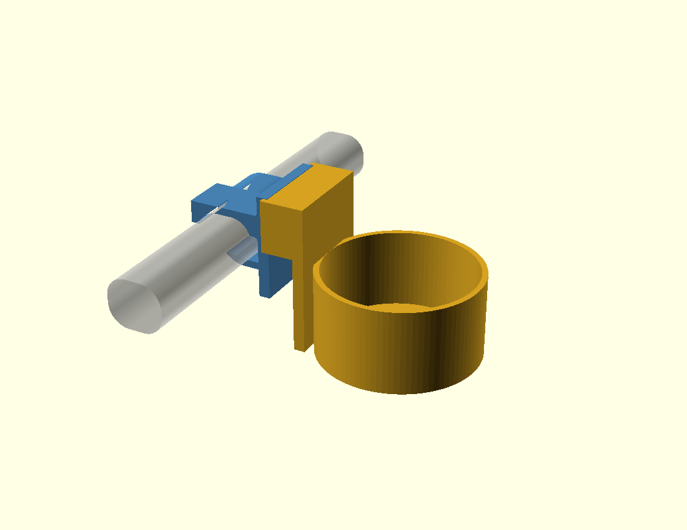
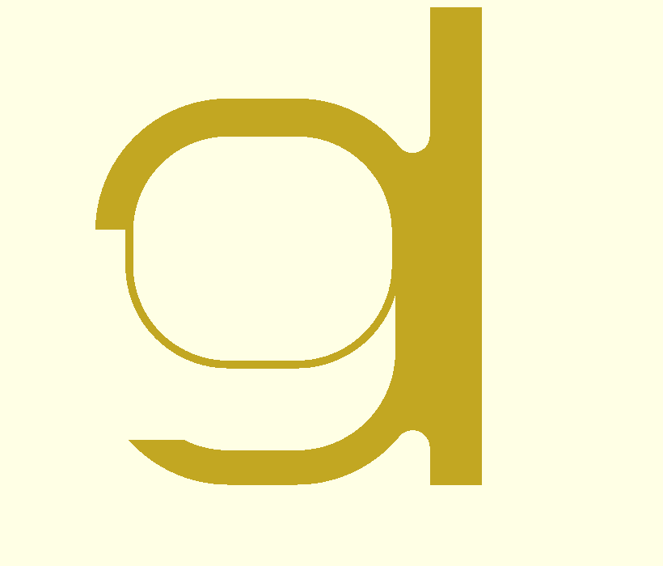
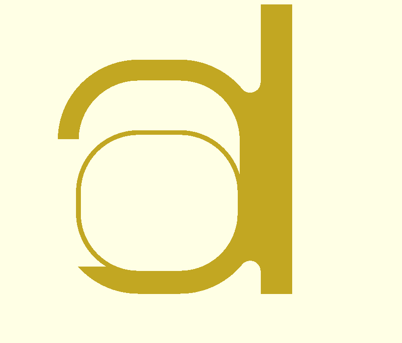
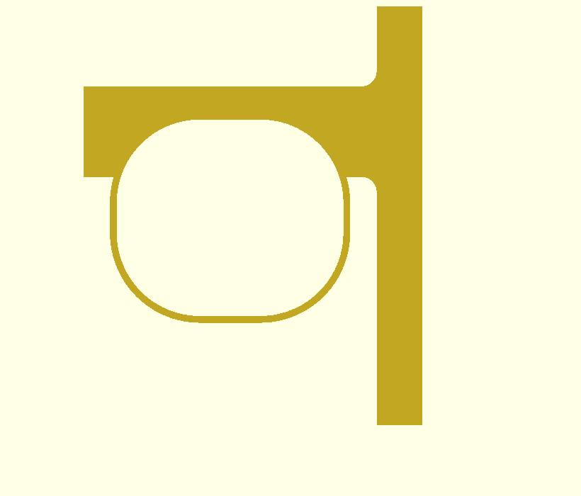

# Chicco Corso handle clip

A parametric handle clip for a Chicco Corso stroller. It clicks onto the side
of the handle bar, then slides down so a cap drops over the top and locks it on.
Attachments — cup holder, phone mount, bag hook — share one interface.

Written from scratch in OpenSCAD. Nothing here is derived from anyone else's
model, so there is no upstream licence to carry.



## ⚠ Status: the handle dimensions are guesses

`handle_w`, `handle_h` and `handle_r` in `stroller_clip.scad` are
**placeholders**. No Corso handle has been measured. Print the gauge, measure
your handle, set those three numbers, and only then print the clip.

## How it works

**On:** hold it high so the cap clears the bar → push on sideways, the jaw
clicks over → slide down, the cap drops over the top.
**Off:** lift, then unclick. Under load it cannot do that by itself.

The jaw bore is a **vertical slot**, 10 mm taller than the bar, and the mouth is
cut only at the height the bar sits at while you are clicking it on. Once you
slide down, the bar has risen past the mouth and is against solid wall:

| | | |
|---|---|---|
|  |  |  |
| **Seated.** Bar at the top of the slot, blocked by 10.8 mm of solid wall. The mouth is empty, below it. | **Raised 10 mm.** Bar has dropped to the bottom of the slot and lines up with the mouth. Only now can it click off. | **The cap**, an inverted U reaching 8 mm down past the bar's shoulder. |

The point of splitting it this way is that **the click never carries the load** —
the cap does. A snap that has to resist load must be tight, and a tight snap
cracks. This one only has to hold the part steady during the slide, so it is
light: **the jaw springs 1.56 mm to click on**, which even PLA will take.

## Workflow

```sh
make            # all STLs into build/
make check      # five clearance checks — all must say "ok"
make preview    # PNGs
```

**1 — Measure.** Print `build/gauge.stl` (or `print/gauge.stl`, ready to go, no
OpenSCAD needed). Flat, no supports, ~30 min.

Press the tapered slot onto the handle until it stops and read the tick level
with the handle. Twice:

- plate held **vertically** → handle **height** (top to bottom) → `handle_h`
- plate held **horizontally** → handle **width** (front to back) → `handle_w`

For `handle_r`: if the grip is round, set all three to `w/2`. If it is a
flattened oval, start at `min(w,h)/2` and reduce if the clip rocks.

**Also check there is 46 mm of straight bar** where you want to mount it. See
the caveat below — this is the one that might bite.

**2 — Test the interface.** Print `build/testfit.stl` (~15 min, no supports):
just the mount and a small loop. Check it drops onto the throat and does not
rattle. Adjust `tongue_gap`.

**3 — Print the clip**, then an attachment.

## Printing

| Part | Orientation | Supports |
|---|---|---|
| `clip` | as exported — standing on end, bar axis vertical | none |
| `testfit` | as exported | none |
| `cupholder` | as exported — ring axis vertical | **touching buildplate** (only under the tongue) |
| `gauge` | flat | none |

Standing the clip on end makes every face a vertical wall: no supports, the
jaw's hoop stress runs along the extrusion lines, and the hanging load sits in
the layer plane instead of peeling layers apart. The jaw and cap are
deliberately adjacent along Z with **no gap**, so the cap's far leg prints on
top of the jaw's far wall rather than starting in mid-air.

PETG or PLA both work now — the light click is what buys that. 4 perimeters,
30 % infill. No hardware.

## The attachment interface

A **throat** on the outboard face: a channel open at the top, running the full
length of the clip. Attachments drop straight down into it — a tongue into the
throat, a crown over the top, a spine down the outboard face, and two cheeks
straddling the clip so nothing slides along the bar. Lift straight up to remove.

| | value |
|---|---|
| throat width | `mnt_reach - mnt_t` = 10 mm |
| throat depth | `mnt_rise` = 15 mm |
| throat floor | y = 5 mm |
| throat root | x = 25.4 mm |
| clip length along bar | `body_len` = 46 mm |

Coordinates as fitted: **+X outboard**, **+Y up**, **+Z along the bar**, origin
at the centre of the bar, z = 0 at the middle of the clip. The model is drawn
in the seated position.

To build your own attachment, call `hook_mount()` and put your geometry
outboard of `spine_x + spine_t`:

```scad
include <stroller_clip.scad>

module phone_tray() {
    hook_mount(spine_bottom = -30);          // how far the spine runs down
    translate([spine_x + spine_t - 2, -30, 0])
        cube([40, 8, 60]);                   // your part goes here
}

upright() phone_tray();
```

Then add it to `checks.scad` and run `make check` before printing.

Because the throat is open at the top and the tip curls up, it doubles as a
plain hook — a bag loop drops into the channel and the tip stops it sliding off.

## Tuning

| Symptom | Change |
|---|---|
| Won't click on | raise `mouth_frac` |
| Clicks on but falls off before you slide it down | lower `mouth_frac` |
| Rattles once seated | lower `fit` |
| Cap won't clear the bar when you lift | raise `slide_travel` (must stay > `cap_engage`) |
| Feels like it could pop up over a bump | raise `cap_engage`, and `slide_travel` with it |
| Rocks front-to-back on the bar | `handle_r` is too large — the bore is rounder than the bar |
| Attachment rattles in the throat | lower `tongue_gap` |
| Attachment won't seat | raise `tongue_gap` |

## Caveats

- **Unmeasured.** See the status note above.
- **It needs 46 mm of straight bar.** This is the one to check before printing.
  You asked for it at the corner of the stroller, and that is exactly where the
  handle curves. If there is not a straight 46 mm run, drop `jaw_len` and
  `cap_len` — but they cannot go much below ~15 mm each before the cap's far leg
  loses the jaw wall underneath it and needs support to print. If the corner is
  tightly curved, the honest fix is to model the bar's curve, which the current
  code does not do: it assumes a straight prismatic bar.
- **The cup holder sits ~87 mm outboard** of the bar centreline. Mostly ring
  radius. Reducing `cup_id` is the quickest way to pull it in.
- **Not load rated.** Sized against roughly 1.2 kg; nothing has been physically
  tested.
- **Don't hang heavy loads on a stroller handle.** Weight on the handle makes a
  stroller tip backwards, a hazard independent of how strong this part is.
  Chicco's manual warns about it.

## Files

| File | |
|---|---|
| `stroller_clip.scad` | parameters, the clip, the attachment interface, sample cup holder |
| `gauge.scad` | handle measuring gauge — print this first |
| `profiles.scad` | cross-sections through the jaw and cap, for `make preview` |
| `checks.scad` | five clearance checks, run via `make check` |
| `print/gauge.stl` | ready to print, no OpenSCAD needed |
