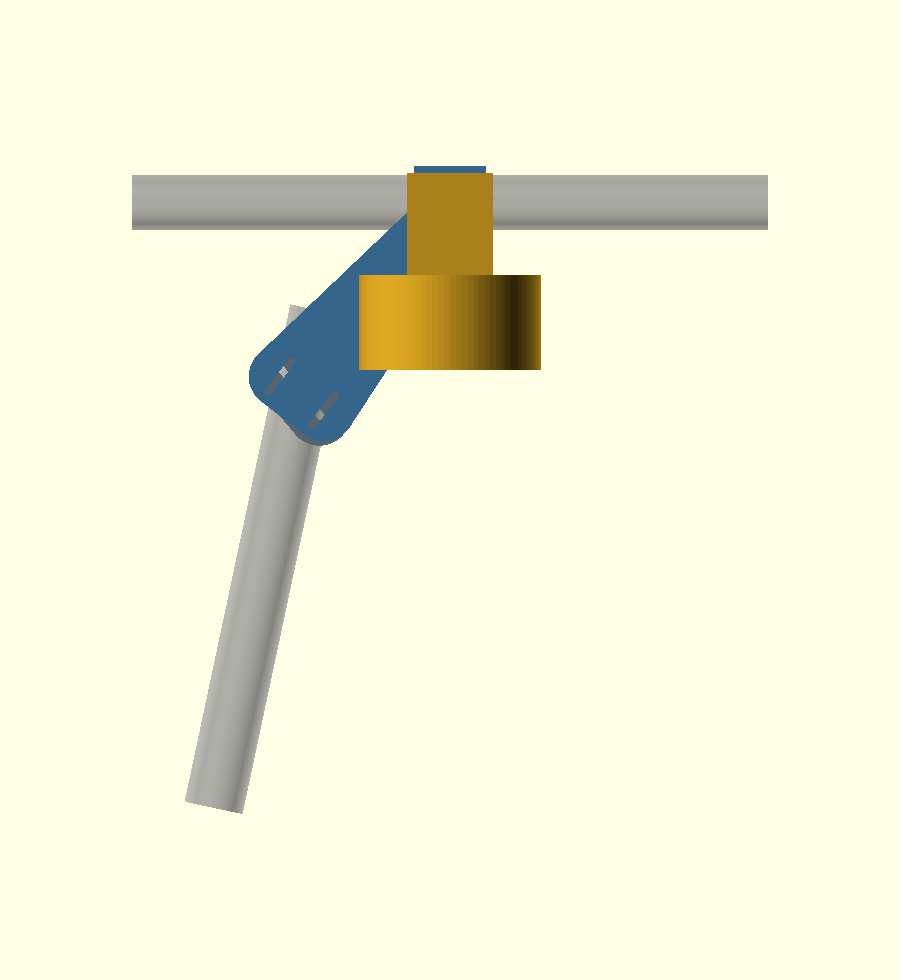

# Chicco Corso corner caddy

Hooks over the top arc of the handle, clips to the side arm, and carries a cup
inboard. Two printed pieces joined by an adjustable slotted bracket, plus a
swappable attachment interface.

Written from scratch in OpenSCAD. Nothing is derived from anyone else's model.



## ⚠ Status: every handle dimension is a guess

`arc_*`, `arm_*`, `nom_run`, `nom_drop` and `arm_tilt` are **placeholders**.
Nothing on a real Corso has been measured. See *What to measure* below.

## How it works

**On:** hold it high so the hook clears the arc → click the claw onto the side
arm → slide down until the hook seats on the arc.
**Off:** slide up until the hook lifts clear, then unclick.

Three things make this work, and they're worth stating separately because each
one removes a problem the earlier designs had:

**The hook carries everything.** It's an inverted U resting on top of the arc.
It sets the height too: sliding down stops when the hook bottoms out. That is
what keeps the side clip from slipping down.

**The claw needs no slot.** The side arm is tilted, so the claw slides freely
*along* it — the arm itself provides the up-and-down travel.

**Neither snap bears load,** so neither has to be tight. The claw springs
**2.8 mm** to click on, and that is all it ever does.

It locks because the two grips wrap bars that aren't parallel. With the hook
down over the arc, the caddy can't translate away from the arm to release the
claw without the hook binding on the arc.

## Why two pieces

The hook is a prism about a bar running one way; the claw is a prism about one
running roughly 90° from it. Both can't print support-free in one piece.

Splitting them buys something better than printability: **the corner becomes
adjustable.** The bend is the one thing genuinely hard to measure, and the
slotted joint gives ±9 mm on each axis plus a few degrees of swivel — so you
set it on the stroller instead of measuring it.

## What to measure

**Two bar cross-sections**, with `print/gauge.stl` (prints flat, no supports,
~30 min). Press the tapered slot on until it stops and read the tick.

| | measure | set |
|---|---|---|
| Top arc, where the hook goes | height and width | `arc_h`, `arc_w`, `arc_r` |
| Side arm, where the claw goes | width and depth | `arm_w`, `arm_h`, `arm_r` |

If a section is round, set `_r` to half the diameter and both other values equal.

**Three rough numbers**, tape measure is fine — the slots absorb the error:

- `nom_run` — horizontal distance, hook spot to claw spot
- `nom_drop` — vertical distance between the same two spots
- `arm_tilt` — degrees the side arm leans out from vertical (eyeball it)

One thing to watch: the arc is wrapped in webbing in places. Put the hook on a
**rubber section**, and measure there.

## Workflow

```sh
make            # STLs into build/
make check      # six clearance checks — all must say "ok"
make preview    # PNGs
```

1. Print the gauge, measure, set the values above.
2. Print `testfit` (~15 min, no supports) to check the attachment interface.
3. Print `hook` and `claw`, bolt them together loosely, fit to the stroller,
   set the geometry, tighten.
4. Print the cup holder.

## Printing

| Part | Orientation | Supports |
|---|---|---|
| `hook` | as exported — standing on the arc axis | none |
| `claw` | as exported — standing on the arm axis | none |
| `cupholder` | as exported | **touching buildplate**, under the tongue only |
| `testfit` | as exported | none |
| `gauge` | flat | none |

Each grip is exported standing on its own bar axis: no supports, hoop stress
along the extrusion lines, hanging load in the layer plane rather than peeling
layers apart.

PLA is fine — the light click is what buys that. 4 perimeters, 30 % infill.

**Hardware:** 2 × M3 × 16 bolts and nuts for the joint. Nothing else.

## The attachment interface

A **throat** on the hook piece's inboard face: a channel open at the top.
Attachments drop in — tongue into the throat, crown over the top, spine down
the outboard face, cheeks straddling the hook. Lift straight up to remove.

| | value |
|---|---|
| throat width | 10 mm |
| throat depth | 15 mm |
| throat root | z = 25 mm |
| hook length along the arc | 34 mm |

Coordinates, standing behind the stroller: **+X along the arc**, **+Y up**,
**+Z inboard toward the seat**. The hook sits at the origin.

```scad
include <stroller_clip.scad>

module phone_tray() {
    hook_mount(spine_bottom = -50);        // how far the spine runs down
    translate([0, -50, spine_z + spine_t - 2]) cube([60, 40, 8], center = true);
}

phone_tray();
```

Add it to `checks.scad` and run `make check` before printing.

The throat doubles as a plain hook — a bag loop drops into the channel and the
tip stops it sliding off.

## Tuning

| Symptom | Change |
|---|---|
| Claw won't click on | raise `claw_frac` |
| Claw falls off before you slide it down | lower `claw_frac` |
| Caddy rocks on the bars | lower `fit` |
| Hook lifts off too easily over bumps | raise `hook_engage` |
| Joint won't reach | raise `slot_len`, or re-measure `nom_run` / `nom_drop` |
| Attachment rattles in the throat | lower `tongue_gap` |

## Caveats

- **Unmeasured.** See the status note.
- **The hook assumes a straight 34 mm run** of arc. It sits past the bend where
  the arc is roughly level, but the arc is still gently curved — if it rocks,
  drop `hook_len`.
- **The cup hangs ~87 mm inboard** of the arc. Mostly ring radius; reduce
  `cup_id` to pull it in.
- **Not load rated.** Nothing has been physically tested.
- **Don't hang heavy loads on a stroller handle.** Weight up there makes a
  stroller tip backwards, a hazard independent of this part's strength.

## Files

| File | |
|---|---|
| `stroller_clip.scad` | parameters, both pieces, attachment interface, cup holder |
| `gauge.scad` | bar measuring gauge — print first |
| `checks.scad` | six clearance checks, via `make check` |
| `print/gauge.stl` | ready to print, no OpenSCAD needed |

`stroller_clip.scad` carries `assert()` guards on the joint and grip geometry.
OpenSCAD turns an undefined name into `undef` and `linear_extrude(undef)`
silently builds something enormous instead of failing — the asserts catch that
class of mistake, which is exactly how a bug got as far as the clearance checks
during development.
